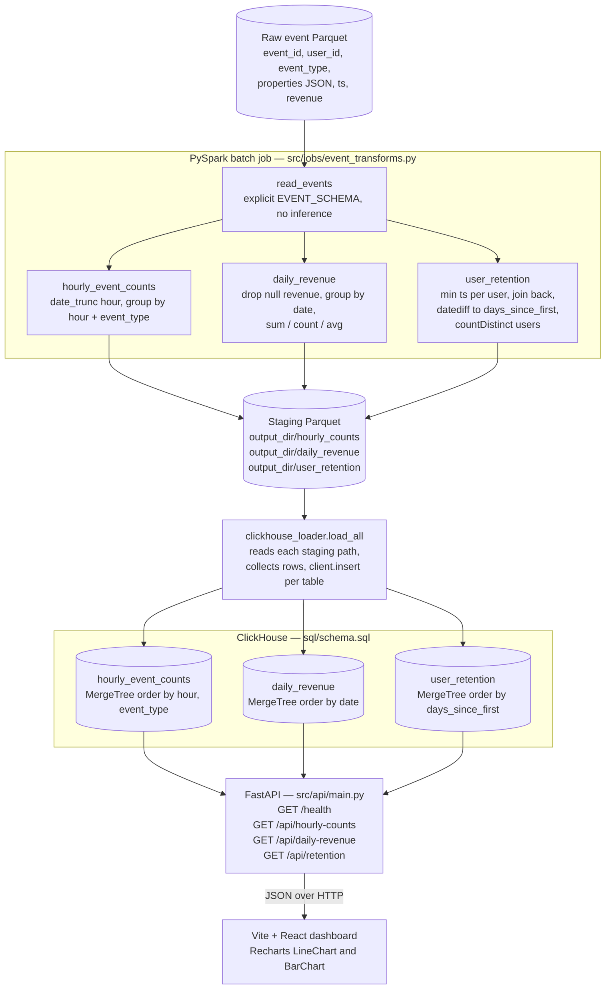
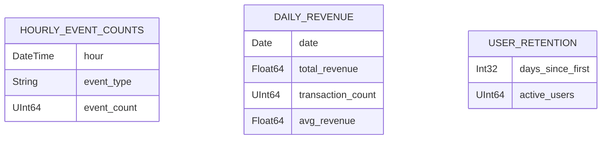

# spark_sight

PySpark batch analytics pipeline over 100M+ events. Computes hourly counts, daily revenue, and user retention cohorts, loads results into ClickHouse OLAP, and serves a React + Recharts dashboard.

## Architecture



The three aggregate tables the whole pipeline exists to produce:



## Components

| Component | Description |
|-----------|-------------|
| `src/jobs/event_transforms.py` | PySpark jobs: hourly counts, daily revenue, user retention |
| `src/jobs/clickhouse_loader.py` | Reads staging Parquet, inserts into ClickHouse |
| `src/api/main.py` | FastAPI endpoints proxying ClickHouse queries |
| `frontend/` | Vite + React dashboard with Recharts line/bar charts |
| `sql/schema.sql` | ClickHouse DDL for all three tables |

## Setup

### Python backend
```bash
python -m venv .venv && source .venv/bin/activate
pip install -r requirements.txt
cp .env.example .env  # set CLICKHOUSE_HOST etc.
```

### Run Spark job
```bash
spark-submit src/jobs/event_transforms.py \
  s3://my-bucket/events/2024/ \
  /tmp/spark_sight_output

python -c "
from pyspark.sql import SparkSession
from src.jobs.clickhouse_loader import load_all
spark = SparkSession.builder.getOrCreate()
load_all(spark, '/tmp/spark_sight_output')
"
```

### Start API
```bash
uvicorn src.api.main:app --reload
```

### Start frontend
```bash
cd frontend && npm install && npm run dev
```

## ClickHouse schema

Run `sql/schema.sql` against your ClickHouse instance:
```bash
clickhouse-client --multiquery < sql/schema.sql
```

## API endpoints

| Endpoint | Description |
|----------|-------------|
| `GET /api/hourly-counts?event_type=&limit=168` | Hourly event counts |
| `GET /api/daily-revenue?days=30` | Daily revenue aggregates |
| `GET /api/retention` | User retention day-N curve |
| `GET /health` | Health check |

## Tests

```bash
pytest tests/ -v  # requires local Spark (master=local[1])
```

## Environment variables

| Variable | Default |
|----------|---------|
| `CLICKHOUSE_HOST` | `localhost` |
| `CLICKHOUSE_PORT` | `8123` |
| `CLICKHOUSE_USER` | `default` |
| `CLICKHOUSE_PASSWORD` | `` |
| `CLICKHOUSE_DB` | `spark_sight` |
